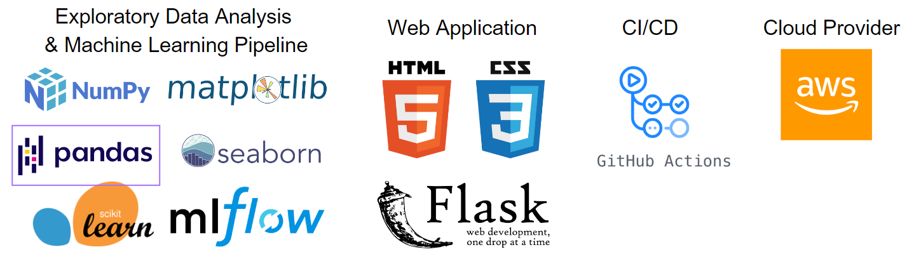
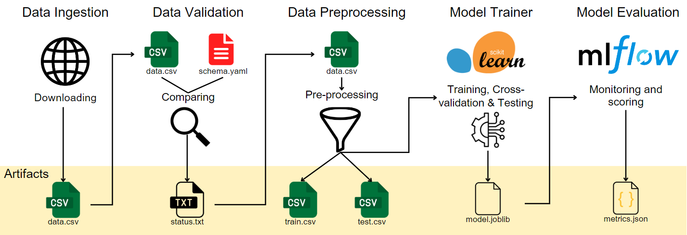
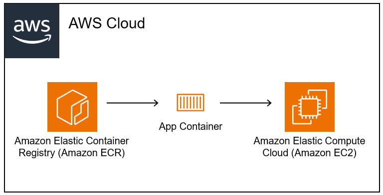

# WaterPurity : A water potability predictor
WaterPurity is a data science project that aims to predict the potability (drinkability) of water based on various chemical properties. This project follows an end-to-end machine learning pipeline, including data ingestion, preprocessing, model training, evaluation, and deployment.

## Project Overview
The project consists of the following main components:

- **Data Ingestion**: Retrieves the water quality dataset from a specified URL.

- **Data Validation**: Validates the ingested data against a predefined schema.

- **Data Preprocessing**: Performs necessary preprocessing steps on the validated data, such as handling missing values, scaling, and feature engineering.

- **Model Training**: Trains multiple machine learning models (Random Forest, SVM, etc.) on the preprocessed data.

- **Model Evaluation**: Evaluates the trained models using metrics like Mean Absolute Error (MAE), R-squared, and Root Mean Squared Error (RMSE). The evaluation results are logged using MLflow for monitoring purposes.

- **Web Application**: A Flask-based web application that allows users to input water quality parameters and receive predictions on water potability.

- **CI/CD Pipeline**: A GitHub Actions workflow that automates the build, testing, and deployment of the project to an Amazon Elastic Container Registry (ECR) and an Amazon Elastic Compute Cloud (EC2) instance.

## Technologies Used


#### Tech Stack:

 

#### WaterPurity pipeline simplified schema



#### Waterpurity Cloud 

 

#### Video Demo :


#### MlFlow :


```
                                         __                                             __                
                                        /\ \__                                       __/\ \__             
                     __  __  __     __  \ \ ,_\    __   _ __   _____   __  __  _ __ /\_\ \ ,_\  __  __    
                    /\ \/\ \/\ \  /'__`\ \ \ \/  /'__`\/\`'__\/\ '__`\/\ \/\ \/\`'__\/\ \ \ \/ /\ \/\ \   
                    \ \ \_/ \_/ \/\ \L\.\_\ \ \_/\  __/\ \ \/ \ \ \L\ \ \ \_\ \ \ \/ \ \ \ \ \_\ \ \_\ \  
                     \ \___x___/'\ \__/.\_\\ \__\ \____\\ \_\  \ \ ,__/\ \____/\ \_\  \ \_\ \__\\/`____ \ 
                      \/__//__/   \/__/\/_/ \/__/\/____/ \/_/   \ \ \/  \/___/  \/_/   \/_/\/__/ `/___/  \
                                                                 \ \_\                              /\___/
                                                                  \/_/                              \/__/ 
                                                                
```